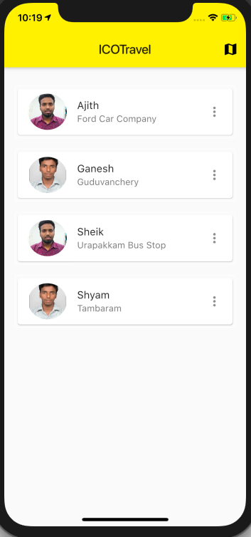
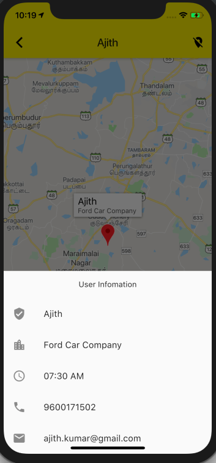
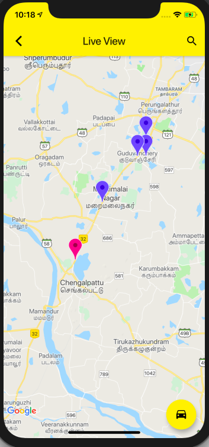
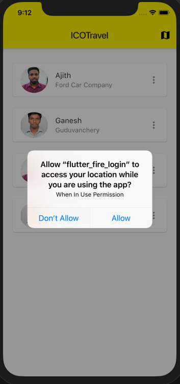
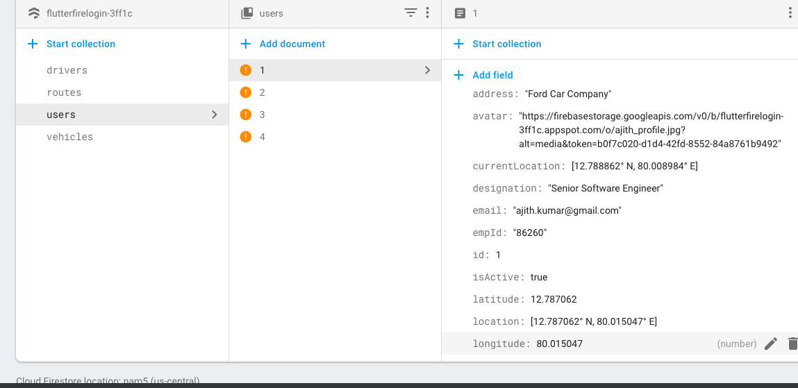
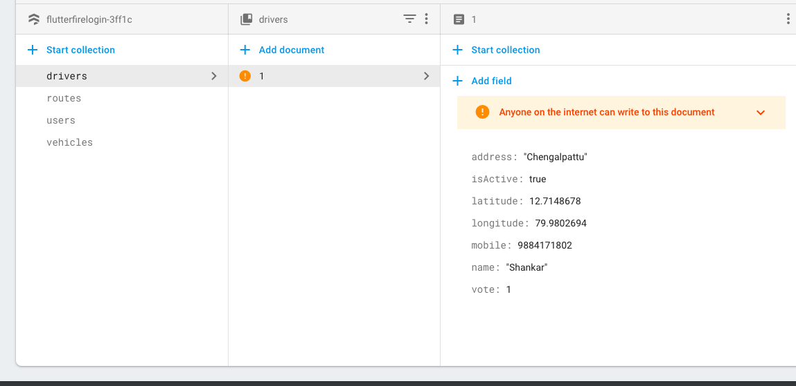
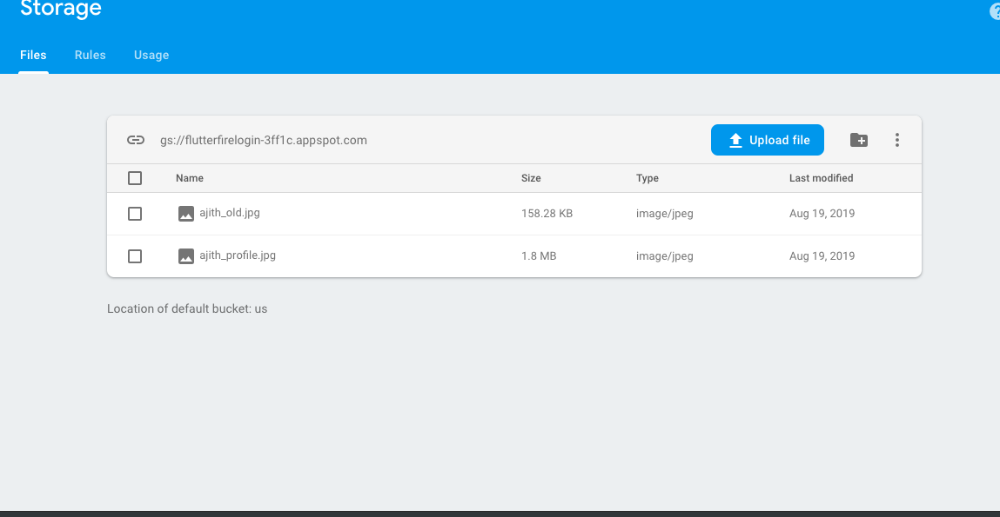

# ICOTravel - Vehicle Live Tracking App

This project is used to track the members of a cab and its location live. It uses firebase for database and file storage.

This project shows how to implement a map view live location tracker  in Flutter, using various Firebase as backend data store.

This was inspired to be implmented like a live tracking like uber in flutter. 

## Project goals

This project shows how to:

- Firebase sign-in method (Not yet implemented)
- Update live location stream (Not yet implmented)
- build a live location map 
- load data from Firebase and display in list
- Locate users and vehicle in map view
- firestore image storage and retrive for profile image
- bottom sheets

I hope this provides a base to kick start your app using Google maps in Flutter.

Feel free to use this in your own projects. 

_NOTE: This project will be kept up to date with the latest packages and Flutter version._

## Preview

 

 

 

 

 

