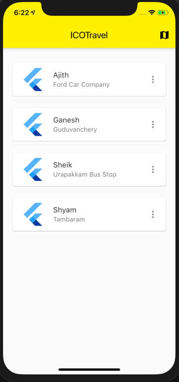
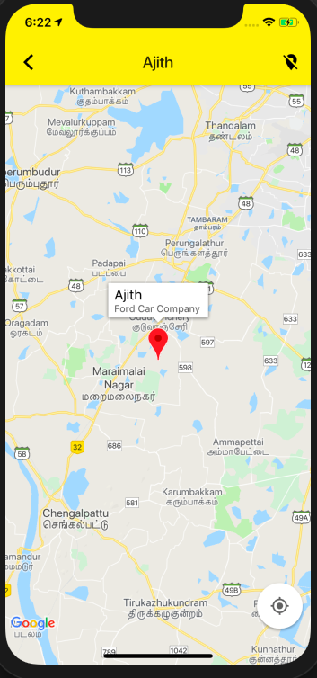
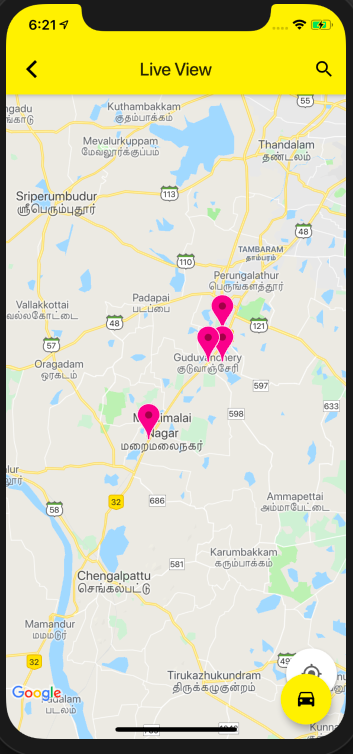

# flutter_fire_login

This project shows how to implement a map view live location tracker  in Flutter, using various Firebase as backend data store.

## Project goals

This project shows how to:

- Firebase sign-in method
- build a live location map
- track users registered using a common map view

Feel free to use this in your own projects. 😉

_NOTE: This project will be kept up to date with the latest packages and Flutter version._

## Preview

